# Restaurant Reviews App

Une plateforme de notation et d’avis pour les plats d’un restaurant (exemple : Costco Food Court).

## Déploiement en production :
[https://menu-item-reviews.vercel.app](https://menu-item-reviews.vercel.app/)

## Description du projet

Ce projet permet aux utilisateurs de :
- Consulter les plats disponibles et leurs avis.
- Laisser, modifier ou supprimer un avis sur un plat.
- Noter chaque plat avec un système d’étoiles et commentaire.
- Gérer leur profil utilisateur.

**Domaine métier choisi :**
- Reviews sur des plats d’un restaurant unique (Costco food court pour la V1).
- Modèle extensible pour plusieurs restaurants, menus, paiement, recommandations, etc. dans les futures versions.
---
## Installation et configuration

```bash
git clone <repo>
cd restaurant-reviews-app
npm install
npx prisma generate
npx prisma db push
npm run dev
```

> ⚠️ **Configurer la base de données** : renseigner la connexion PostgreSQL dans le fichier `.env` à la racine du projet.

---
## 🏗️ Architecture technique et choix de conception

### Stack technique

- **Next.js 14 (App Router)** : Routing, pages et API RESTful.
- **Prisma ORM (PostgreSQL)** : Accès, migrations et relations de la base de données.
- **TypeScript** : Typage statique, robustesse et sécurité.
- **Tailwind CSS** : Design responsive et composants UI modernes.
- **Swagger** : Documentation interactive et testable de l’API.
- **Zod** : Validation stricte des données côté API.
- **Vercel** : Hébergement et déploiement continu.
- **Shadcn/ui** : Composants UI accessibles et stylés.
- **Clerk.dev** : Gestion complète de l’authentification et des utilisateurs.


### Schéma d'Architecture

- **Architecture (Mermaid)**

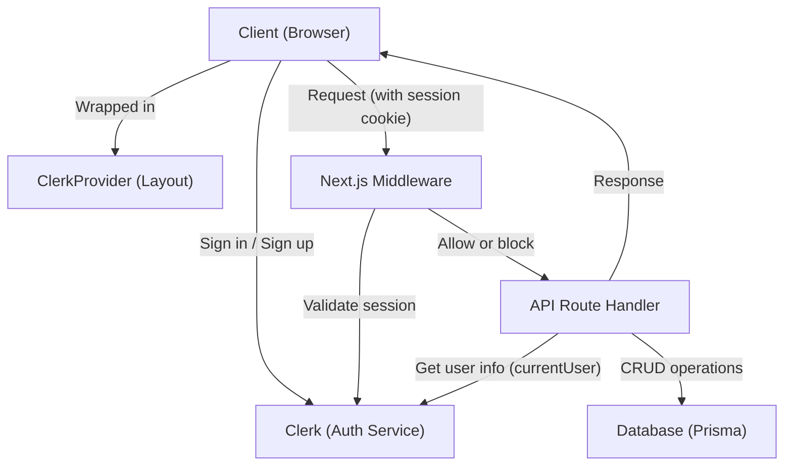

- **Séquence: Authentification et accès protégé**

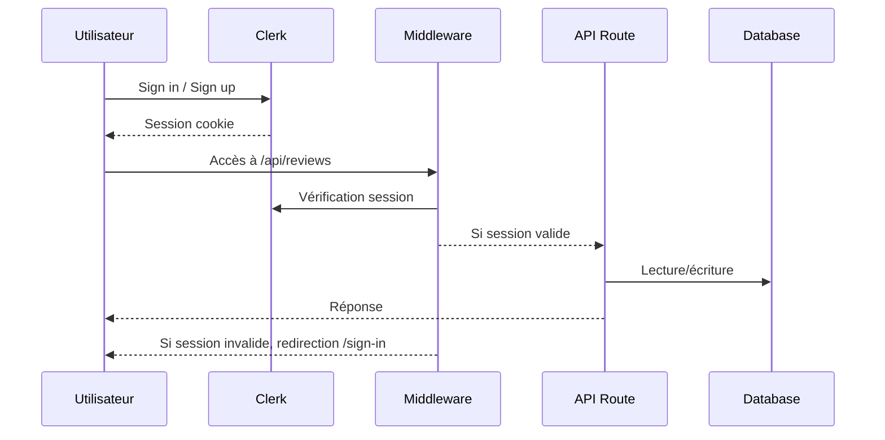

### Structure fonctionnelle et parcours utilisateur

- **Authentification** :
	- Inscription et connexion par email (création automatique de l’utilisateur à la première connexion).
	- Modification du nom d’utilisateur possible depuis le profil.
	- Authentification requise pour toute action d’ajout, modification ou suppression d’avis.

- **Gestion des avis (reviews)** :
	- Un utilisateur connecté peut ajouter un avis (note + commentaire) sur chaque plat, mais un seul avis par plat (contrainte unique).
	- Un utilisateur peut modifier ou supprimer uniquement ses propres avis.
	- Les utilisateurs non connectés peuvent consulter la liste des plats et des avis, mais ne peuvent pas interagir.

- **Gestion des plats (menu items)** :
	- Tous les utilisateurs peuvent consulter la liste des plats et les détails.

- **Gestion du profil utilisateur** :
	- Chaque utilisateur peut consulter et modifier son profil (nom).

- **Sécurité et validation** :
	- Toutes les routes sensibles vérifient l’authentification via Clerk.(v2)
	- Les entrées utilisateur sont validées côté API (Zod) et les erreurs sont explicites.
	- Inscription et connexion via Clerk (email, Google, autres providers).
	- Synchronisation automatique des utilisateurs Clerk avec la base de données locale.
	- Modification du nom d'utilisateur possible depuis le profil.
	- Authentification requise pour toute action d'ajout, modification ou suppression d'avis.

### Structure principale du projet (arborescence code)

- `/app` : Contient toutes les pages principales de l’application (UI) et les routes API (Next.js App Router).	
	- `api/` : Dossier des routes API (voir `documentation/SERVICES.md` pour le détail).
	- `api-docs/` : Page de documentation interactive de l’API (Swagger UI).
	- `page.tsx` : Page d’accueil (landing page).
	- `login/` : Pages de connexion et d’accueil après connexion.
	- `menu-items/` : Pages de liste et détail des plats.
	- `profile/` : Pages de profil utilisateur (voir, éditer).
	- `reviews/` : Pages de gestion des avis (tous les avis, mes avis, édition).
	- `sign-in/` : Pages de connexion (login) et authentification Clerk.(v2)
	- `/sign-up/` : Pages d’inscription (signup) et création de compte Clerk..(v2)
	- `/user-profile/` : Pages de profil utilisateur Clerk (gestion complète du compte).(v2)
- `/components` : Composants React réutilisables facilitant la construction de l’interface utilisateur.
    - `/ui` : Composants UI génériques (button,card,label).
    - `ReviewForm` : Formulaire pour créer ou modifier un avis (note + commentaire).
	- `ReviewList` : Affichage de la liste des avis pour un plat ou un utilisateur.
	- `ReviewCard` : Carte individuelle affichant le détail d’un avis (auteur, note, commentaire, actions).
	- `StarRating` : Composant interactif d’affichage et de saisie de la note sous forme d’étoiles.
	- `Navbar` : Barre de navigation principale de l’application (liens, connexion, etc.).
- `/prisma` : Fichiers liés à la base de données Prisma :
	- `schema.prisma` : Modèle de données principal (tables, relations, contraintes).
	- `seed.ts` : Script de peuplement de la base de données avec des données d’exemple.
- `/lib` : Fonctions utilitaires et helpers partagés (ex : configuration Prisma, rating , swagger).
- `/types` : Définitions TypeScript personnalisées 
	- `index.ts` : Définit les interfaces principales utilisées dans l’application (Review, MenuItem, User) :
- `/documentation` : Documentation du projet :
	- `README.md` : Présentation générale, instructions, architecture, captures d’écran, etc.
	- `CODE_ANALYSIS.md` : Analyse détaillée du code, choix techniques, patterns utilisés.
	- `SERVICES.md` : Détail des services/API, endpoints, schémas de réponse/erreur.
	- `swagger.json` : Spécification OpenAPI générée pour l’API REST, utilisée pour la documentation interactive (Swagger UI) et les outils tiers.
	- `screenshots/` : Captures d’écran de l’application pour la documentation.

- `/public` : Fichiers statiques accessibles publiquement. Ce projet contient uniquement les images des plats du menu utilisées pour illustrer chaque plat dans l’interface.
- `/test` : Fichiers de test et utilitaires de test :
	- `api.http` : Fichier de requêtes HTTP pour tester les endpoints de l’API (utilisé avec VS Code REST Client).(Version 1.0 seulement)
 
---
## 📸 Captures d’écran(Version 1 VS Version 2)

### Pages générales
- **Page d’accueil** (landing page, non connecté) 
  - **Version 1 (Avant)** 
  
  - **Version 2 (Après)**
	 


- **Page de connexion** (login) 
  - Version 1 (Avant) 
	
  - **Version 2 (Après)**

- **Page d’accueil après connexion** (vue personnalisée)
  - **Version 1 (Avant)**
	
  - **Version 2 (Après)**
    

### Parcours plats & avis
- **Liste des plats** (menu)  
	- **Version 1 (Avant)**		
	
	- **Version 2 (Après)**
	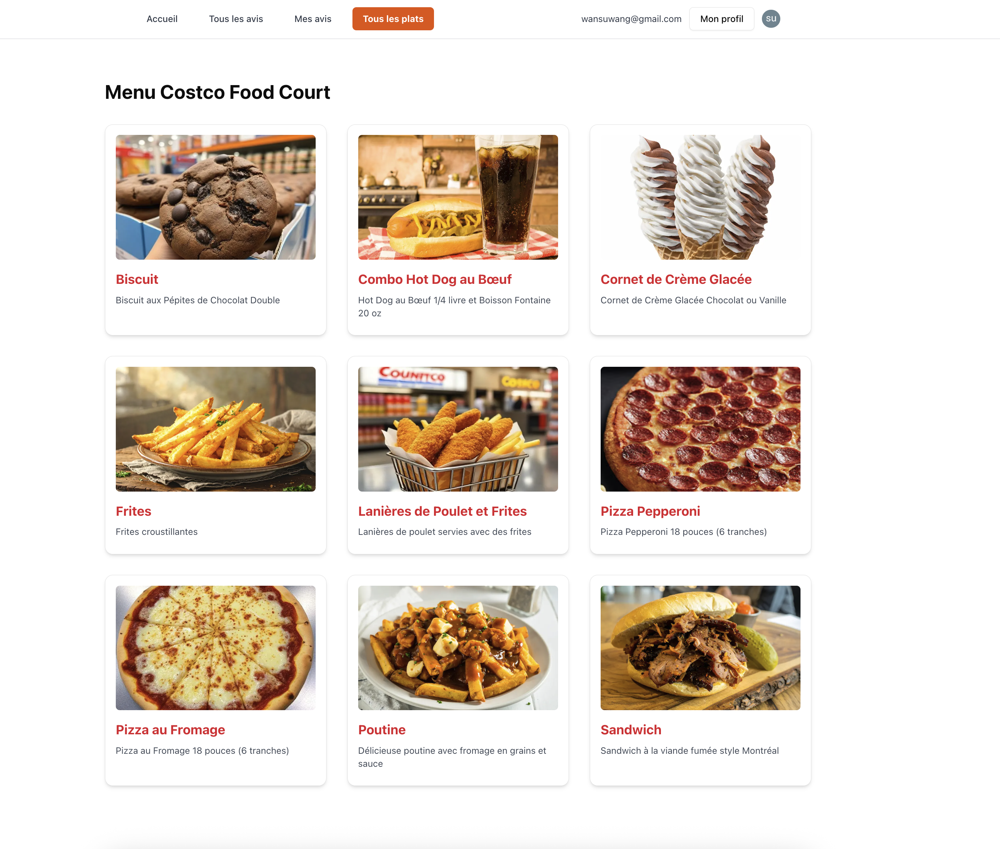

- **Détail d’un plat** (avec liste d’avis)
    - **Version 1 (Avant)**
	
    - **Version 2 (Après)**
	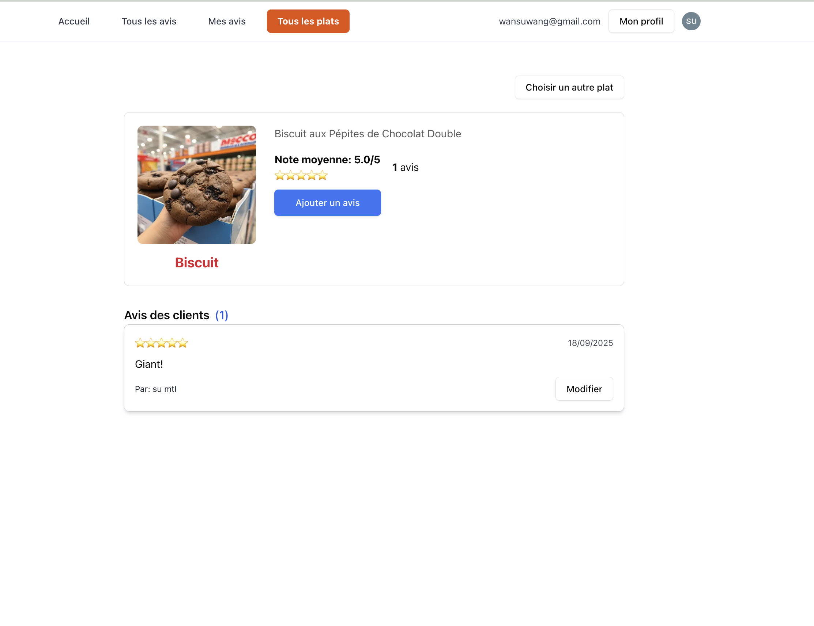
- **Tous les avis**  
	

- **Tous les avis (pagination，si le nombre d’avis dépasse 10)**
	

- **Mes avis**   
	

- **Formulaire de création d’avis**  
	

- **Création d’avis réussie**  
	

- **Erreur : note manquante**  
	

- **Erreur : commentaire manquant**  
	

- **Erreur : avis déjà existant** 
	

- **Formulaire de modification d’avis** (pré-rempli avec les informations existantes)  
	

- **Modification d’avis réussie**  
	

- **Suppression d’un avis** (confirmation ou résultat)  
	

### Utilisateur
- **Inscription** (signup) 
	- **Version 2 (Après)**
	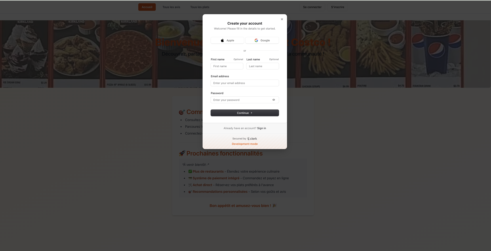 
- **Login**(signin)
	- **Version 2 (Après)**
	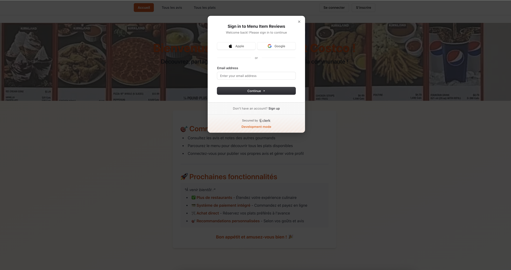
- **Logout** 
	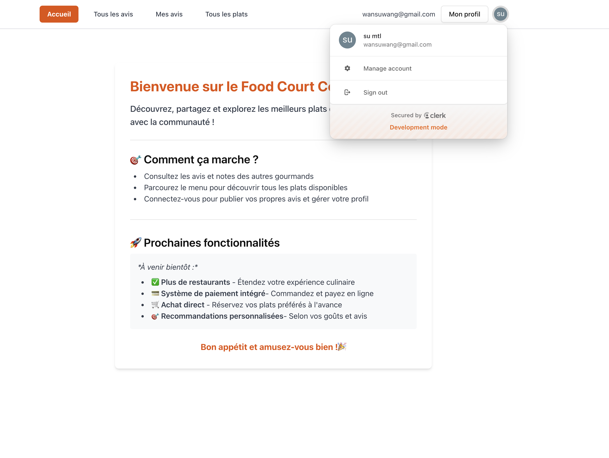    
- **Profil utilisateur** (vue) 
    - **Version 1 (Avant)**
	
    - **Version 2 (Après)**
	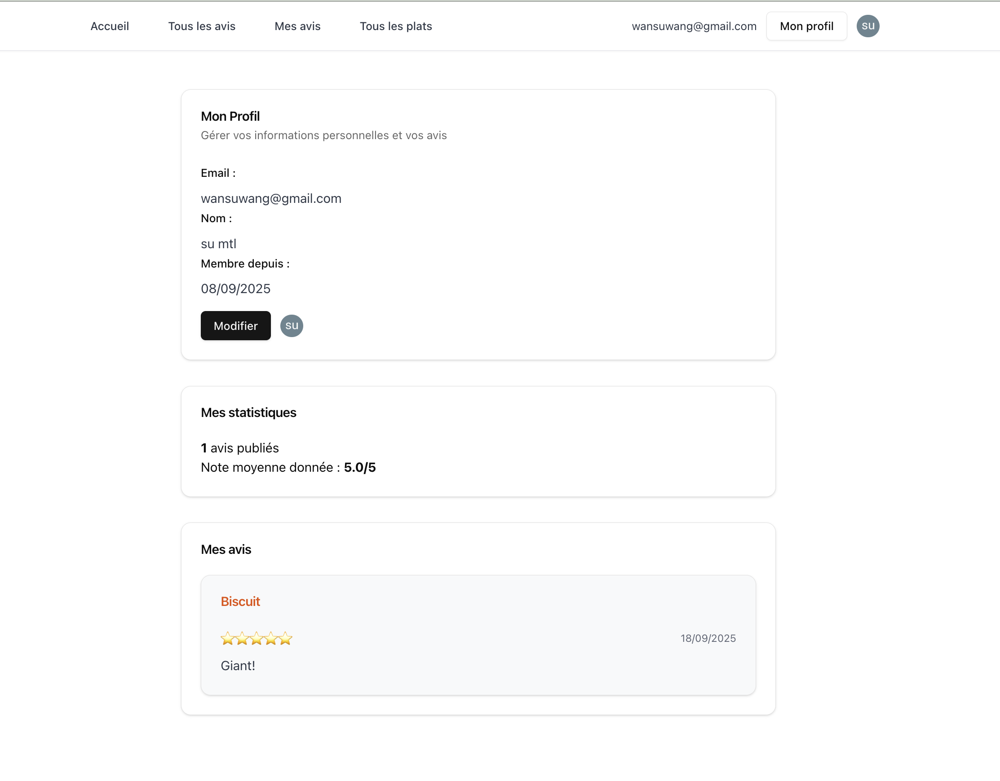

- **Profil utilisateur** (édition) 
    - **Version 1 (Avant)**
	
    - **Version 2 (Après)**
	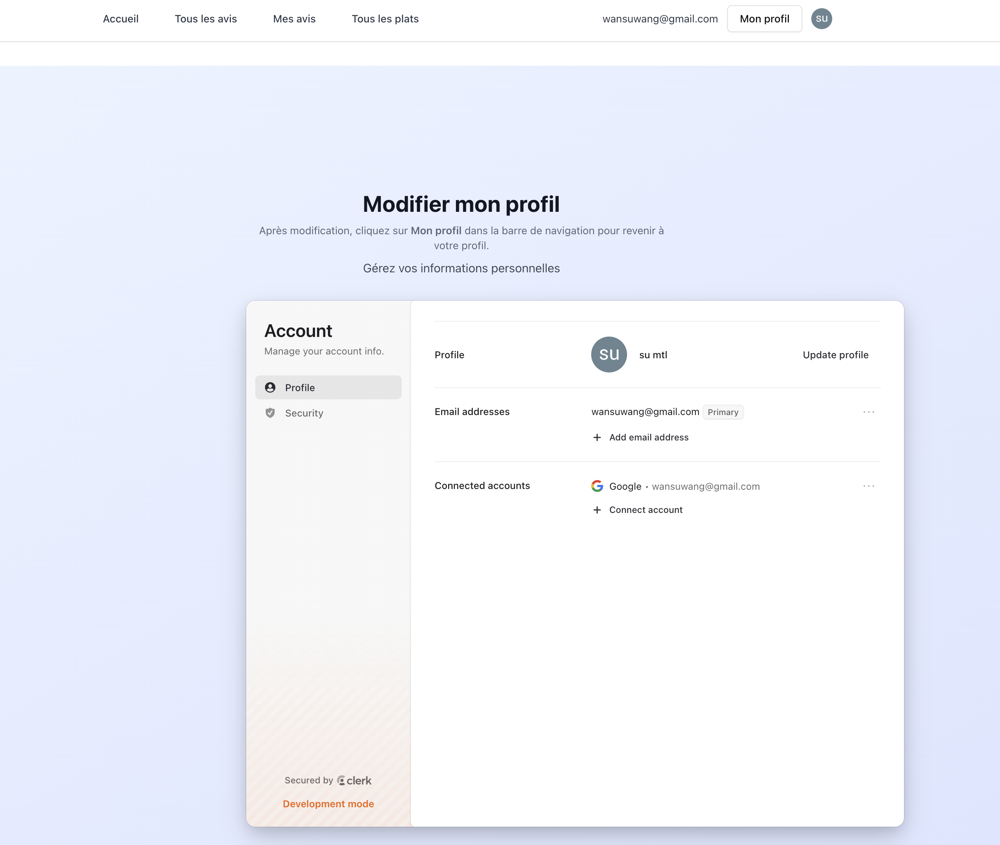
	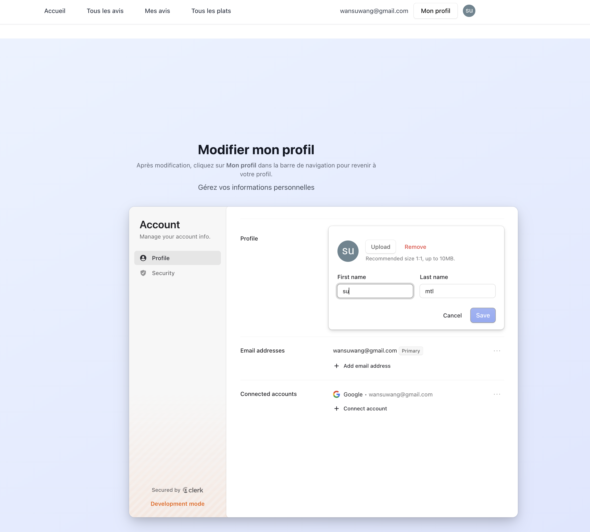


### Documentation API intégrée (Swagger UI)
- **Version 1 (Avant)**
  - Partie 1 
    
  - Partie 2 :
    
- **Version 2 (Après)**
	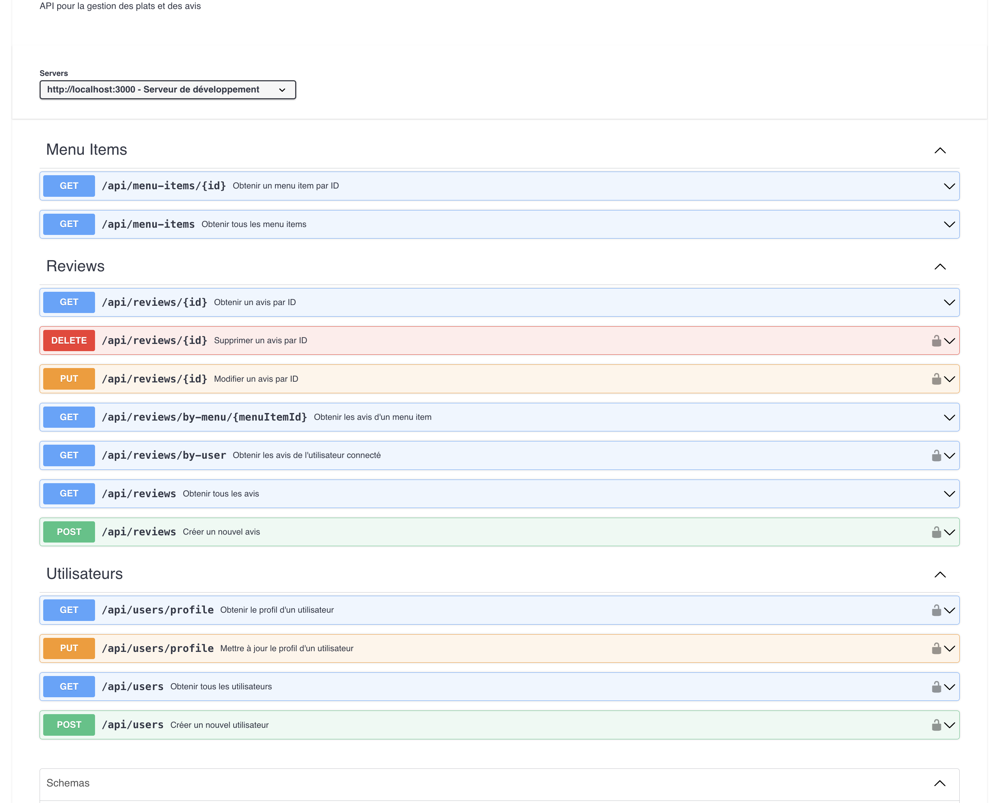

---
## 🚀 Instructions de déploiement (Vercel)

1. Créez un compte sur [Vercel](https://vercel.com/) si ce n’est pas déjà fait.
2. Cliquez sur « New Project » et importez ce repository GitHub.
3. Lors de la configuration du projet :
	- Renseignez les variables d’environnement nécessaires (ex : `DATABASE_URL` pour PostgreSQL).
	- Vérifiez que le framework détecté est bien **Next.js**.
4. Lancez le déploiement.
5. Une fois le build terminé, l’application sera accessible à l’URL fournie par Vercel.

> Pour toute modification, poussez simplement sur la branche principale : Vercel redéploiera automatiquement.